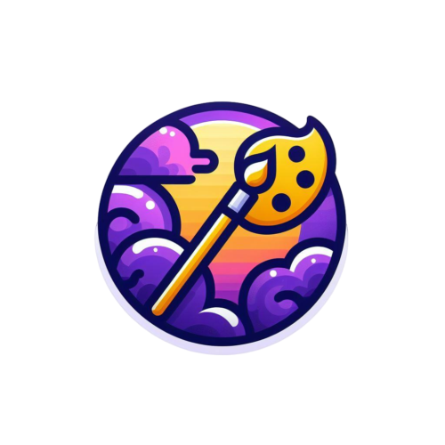
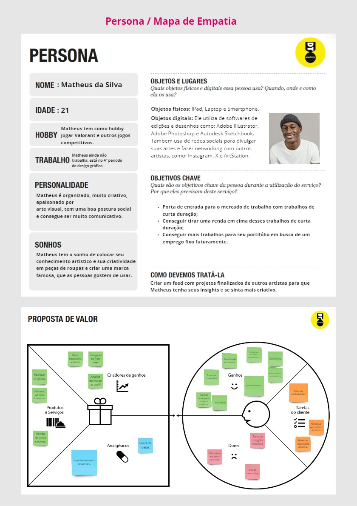
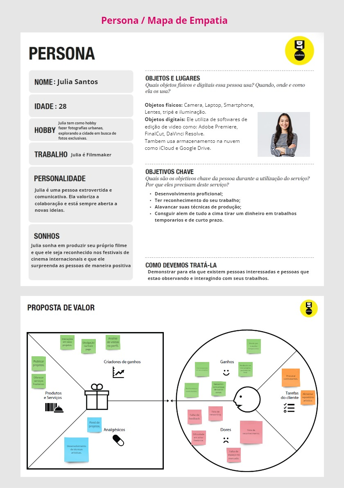
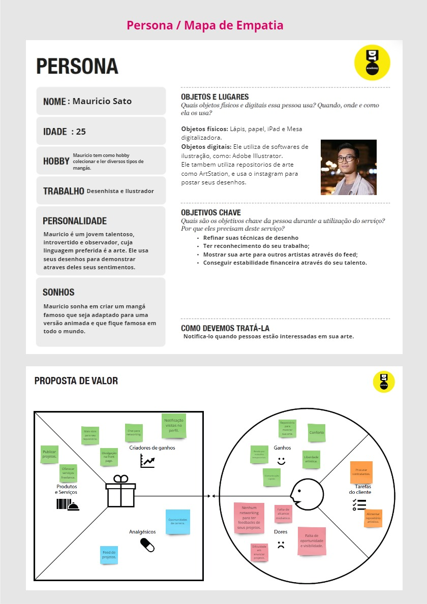
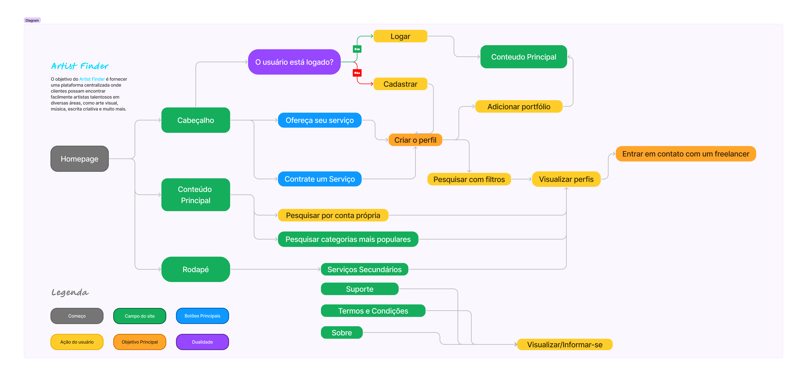
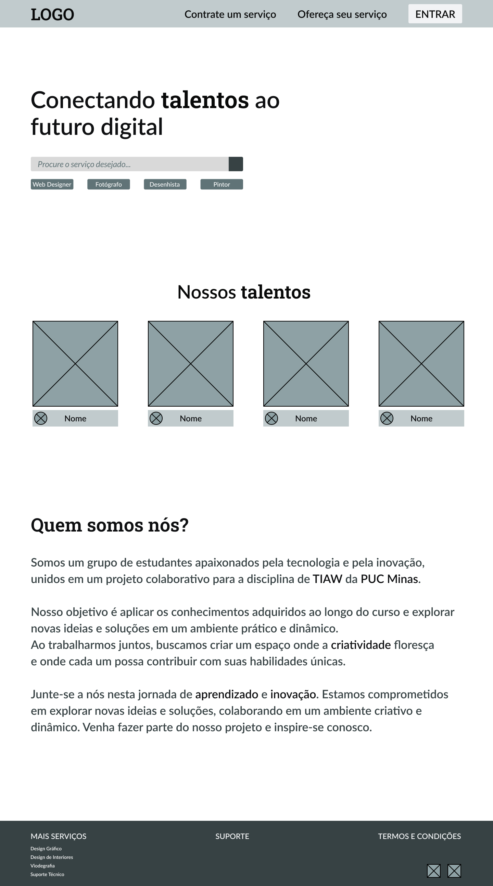
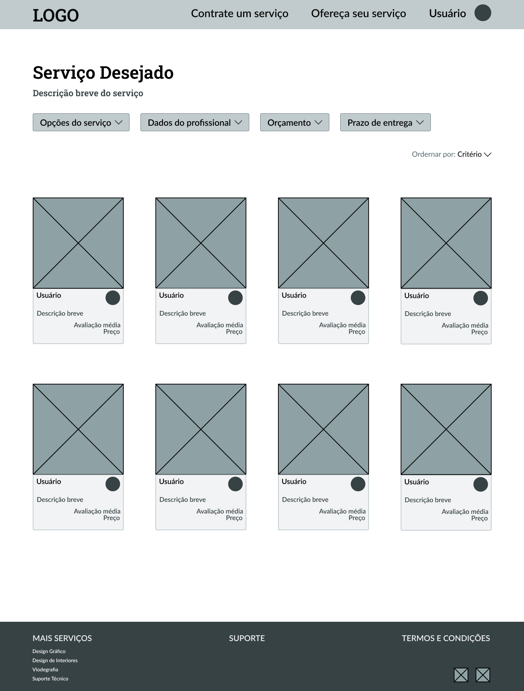
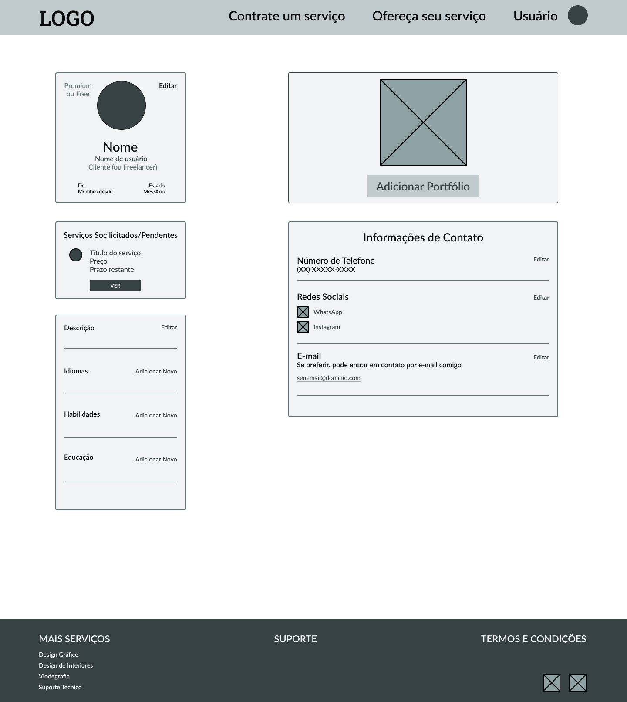
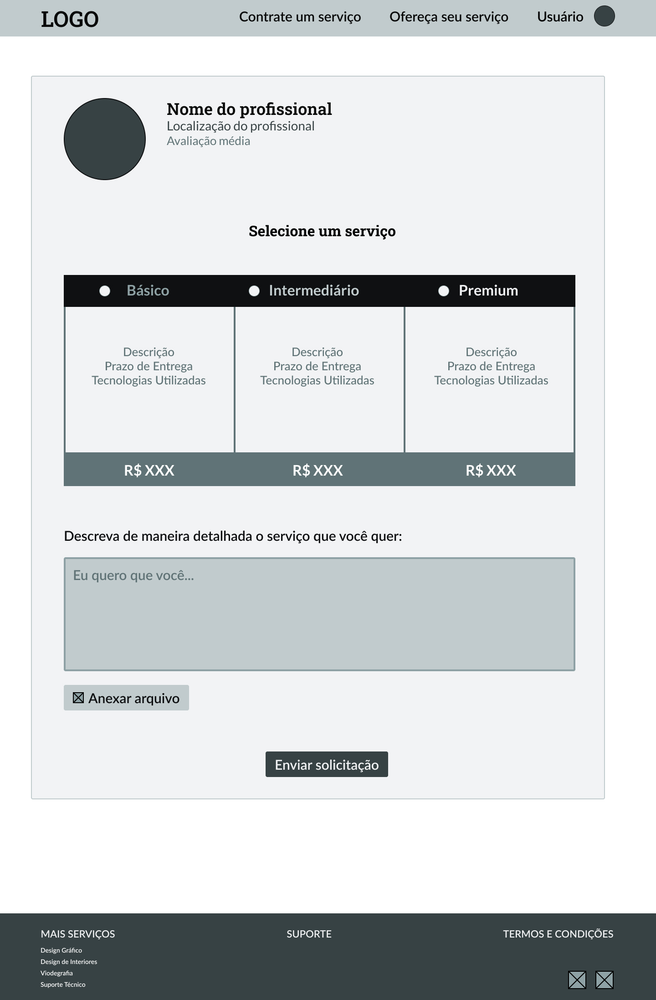
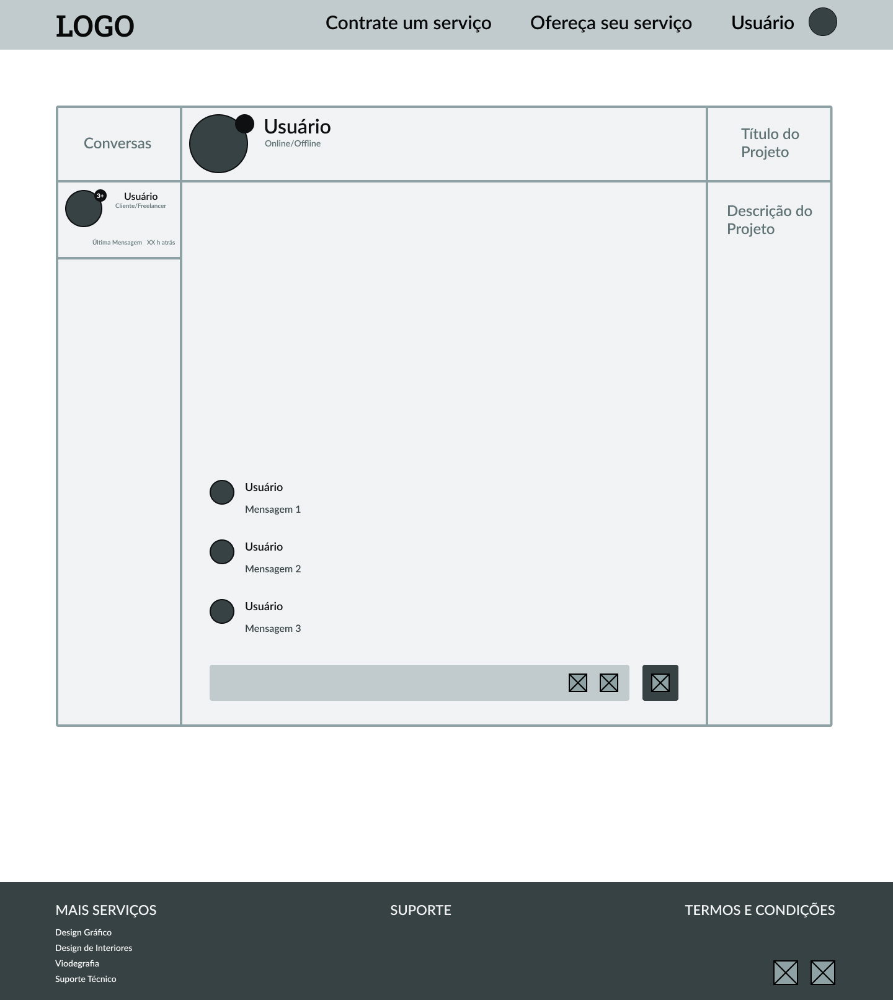

# Informações do Projeto

`Título do Projeto`  
Artist Finder  

`Curso`
Análise e Desenvolvimento de Sistemas & Sistemas de Informação

`Disciplina`
Trabalho Interdisciplinar: Aplicações Web 

## Participantes

Os membros do grupo são:

- Filipe Augusto dos Santos Silva
- Pablo Marques Cordeiro
- Lucas Fernandes Nascimento
- João Gabriel Soares Da Silva Franco
- Diego Romero Ribeiro Chaves
- Alfredo Rodrigues Simões Macedo Campos

# Estrutura do Documento

- [Informações do Projeto](#informações-do-projeto)
  - [Participantes](#participantes)
- [Estrutura do Documento](#estrutura-do-documento)
- [Introdução](#introdução)
  - [Problema](#problema)
  - [Objetivos](#objetivos)
  - [Justificativa](#justificativa)
  - [Público-Alvo](#público-alvo)
- [Especificações do Projeto](#especificações-do-projeto)
  - [Personas e Mapas de Empatia](#personas-e-mapas-de-empatia)
  - [Histórias de Usuários](#histórias-de-usuários)
  - [Requisitos](#requisitos)
    - [Requisitos Funcionais](#requisitos-funcionais)
    - [Requisitos não Funcionais](#requisitos-não-funcionais)
  - [Restrições](#restrições)
- [Projeto de Interface](#projeto-de-interface)
  - [User Flow](#user-flow)
  - [Wireframes](#wireframes)
- [Metodologia](#metodologia)
  - [Divisão de Papéis](#divisão-de-papéis)
  - [Ferramentas](#ferramentas)
  - [Controle de Versão](#controle-de-versão)
- [**############## SPRINT 1 ACABA AQUI #############**](#-sprint-1-acaba-aqui-)
- [Projeto da Solução](#projeto-da-solução)
  - [Tecnologias Utilizadas](#tecnologias-utilizadas)
  - [Arquitetura da solução](#arquitetura-da-solução)
- [Avaliação da Aplicação](#avaliação-da-aplicação)
  - [Plano de Testes](#plano-de-testes)
  - [Ferramentas de Testes (Opcional)](#ferramentas-de-testes-opcional)
  - [Registros de Testes](#registros-de-testes)
- [Referências](#referências)

# Introdução

Bem-vindo ao Artist Finder, a plataforma online projetada para conectar artistas talentosos a clientes em busca de talento criativo. Com uma interface intuitiva e poderosas funcionalidades de busca, o Artist Finder facilita a descoberta e contratação de artistas para uma variedade de projetos. Explore nossa comunidade de artistas e descubra o talento certo para transformar suas ideias em realidade.

## Problema

Os artistas em geral hoje enfrentam uma luta constante para encontrar oportunidades que correspondam às suas habilidades e paixões, devido à escassez de conexões e à dificuldade em divulgar seus portfólios. Enquanto isso, os clientes em busca de talentos qualificados muitas vezes se veem perdidos em um mar de opções dispersas, sem uma plataforma centralizada e confiável para encontrar e avaliar profissionais freelancer como artistas e músicos no geral. Essa lacuna na conexão entre ambos os grupos cria desafios significativos, apesar de haver a existência de apps como Linkedin ou Fiverr, ainda sim é complicado para os artistas e possíveis clientes, limitando as opções disponíveis para ambos os lados e dificultando o crescimento profissional e financeiro dos artistas e profissionais da criatividade, ao mesmo tempo em que prejudica os clientes na busca por soluções adequadas para seus projetos.

## Objetivos

Nosso principal objetivo é aproximar os dois mundos; tanto os contratantes/clientes quanto os artistas freelancers, fornecendo um espaço para adicionarem seus portfólios, e apresentarem sua arte. Queremos a partir deste objetivo, abrir espaços para colocarem seu estilo de arte seja ele música, design, desenho, pintura, fotografia, web design etc. Teremos também várias categorias para cada tipo específico de trabalho para facilitar para os clientes acharem o que precisam, ferramentas de busca e alguns filtros de pesquisa serão incrementados também.

## Justificativa

Os artistas digitais hoje em dia, tem muita dificuldade para anunciar seus trabalhos, e isso faz parte de uma junção de dois fatores principais: 

- A demora para possíveis clientes encontrarem artistas para seus objetivos específicos. 
- A dificuldade dos artistas apresentarem seus trabalhos, através de um portfólio com ferramentas que atraiam um possível cliente.

## Público-Alvo

 Nosso público-alvo são jovens adultos entre 18 aos 40 anos que estão começando a se desenvolver profissionalmente, sejam artistas independentes e estejam procurando trabalhos freelancer para expandir sua rede de contatos profissional, mostrar seus talentos e assumir projetos remunerados. Por outro lado, empresas que procuram talentos criativos para projetos, projetos esses, administrados por adultos de meia-idade entre 40 e 65 anos que trabalham em áreas como marketing, publicidade, design de produtos, entre outros. 

# Especificações do Projeto

As especificações do projeto foram estruturadas com base em pesquisas detalhadas realizadas com usuários e profissionais da área artística. Essas pesquisas forneceram insights valiosos sobre as necessidades, preferências e expectativas dos usuários, direcionando o desenvolvimento de uma plataforma intuitiva, eficaz e centrada no usuário.

## Personas e Mapas de Empatia

Persona 1:

Persona 2:

Persona 3:

## Histórias de Usuários

Com base na análise das personas forma identificadas as seguintes histórias de usuários:

|EU COMO... `PERSONA`| QUERO/PRECISO ... `FUNCIONALIDADE` |PARA ... `MOTIVO/VALOR`                 |
|--------------------|------------------------------------|----------------------------------------|
|Larissa Alves  | Expor meu trabalho para ter mais alcance entre empresas | Aumentar minha renda mensal fazendo mais freelances de arte digital|
|Marcos Terra | Achar mais artistas que trabalham na minha área | Ganhar mais conhecimento sobre arte e aprimorar minhas técnicas |
|Fernando Pereira | Procurar artistas que atendem a minha necessidade | Conseguir um logotipo para minha nova empresa |
|Mateus Calixto | Conseguir configurar meu perfil e expor meu portfólio de maneira que me agrade | Trabalhar em uma área confortável para me motivar mais |
|Álvaro dos Santos | Desejo um site específico para artistas | Achar com mais facilidade um serviço de freelance requisitado pela empresa |
|Rogério Gomes | Forma de pagamento seguras | Ter segurança quando for efetuar uma compra no site |
|Bruna Silva | Um meio de comunicação com os donos do site | Ter apoio quando houver alguma dúvida ou algum erro |

## Requisitos

As tabelas que se seguem apresentam os requisitos funcionais e não funcionais que detalham o escopo do projeto.

### Requisitos Funcionais

|ID    | Descrição do Requisito  | Prioridade |
|------|-----------------------------------------|------|
|RF-001| Chat interativo                         | ALTA | 
|RF-002| Feed de destaques                       | ALTA |
|RF-003| Portfólio personalizado                 | ALTA |
|RF-004| Avaliação de desempenho                 | ALTA |
|RF-005| Plano de conta free ou premium          | MÉDIA |
|RF-006| Sugestão de categorias relevantes       | MÉDIA |

### Requisitos não Funcionais

|ID     | Descrição do Requisito  |Prioridade |
|-------|-------------------------|-----------------------------|
|RNF-001| Autenticação simplificada com google ou apple | BAIXA | 
|RNF-002| Design responsivo                             | BAIXA | 
|RNF-003| Integração com redes sociais do profissional  | BAIXA | 

## Restrições

O projeto está restrito pelos itens apresentados na tabela a seguir.

|ID| Restrição                                             |
|--|-------------------------------------------------------|
|01| O projeto deverá ser entregue até o final do semestre |
|02| Não pode ser desenvolvido um módulo de backend        |

# Projeto de Interface

Nossa plataforma foi concebida com um propósito claro em mente: facilitar a conexão entre profissionais freelancers e clientes em busca de profissionais qualificados. Reconhecendo as dificuldades enfrentadas tanto pelos profissionais em divulgar seus trabalhos quanto pelos clientes em encontrar esses talentos, desenvolvemos uma série de requisitos cuidadosamente planejados para atender a essas necessidades específicas.

Principais requisitos que compõe a aplicação:

- Chat Interativo:

Facilita a comunicação direta entre clientes e freelancers, permitindo a discussão de projetos e esclarecimento de dúvidas de forma rápida e eficiente.

- Destaques em Destaque:

Destaca obras de destaque na página principal, proporcionando aos clientes uma visão rápida e inspiradora do talento disponível na plataforma.

- Portfólio Personalizado:

Permite que os freelancers exibam seus trabalhos anteriores de forma detalhada, ajudando os clientes a avaliar sua experiência e estilo.

- Avaliações Transparentes:

Oferece um sistema de avaliação transparente, permitindo que os clientes forneçam feedback detalhado sobre a experiência com os freelancers.

- Planos de Conta Flexíveis:

Oferece opções de conta gratuitas e premium, permitindo que os usuários escolham o nível de funcionalidades que melhor atenda às suas necessidades e orçamento.

- Categorias Relevantes em Destaque:

Destaca as categorias mais buscadas na plataforma, simplificando a busca por profissionais e projetos específicos.

A elaboração dos requisitos teve como ponto de partida as pesquisas com os profissionais freelancer, a partir daí, com as necessidades em mente, conseguimos pensar em funcionalidades que atendam esses profissionais, tornando assim, a plataforma fácil e útil. Os requisitos não funcionais tiveram como base heurísticas que já existem em sites nesse segmento, sendo assim, torna-se necessário a adição desses requisitos para correta adaptação no mercado.

## User Flow

O User Flow do site foi cuidadosamente planejado para atender a dois objetivos principais:

- Criação de Perfil:

Permitindo que os usuários criem um perfil, eles podem acessar ferramentas como a criação de um perfil freelancer, adição de portfólio e descrição de suas qualidades. Ou, se preferirem, podem visualizar perfis de freelancers, filtrar pesquisas de acordo com suas necessidades específicas.

- Contato com um Freelancer: 

O objetivo final é facilitar o contato direto entre cliente e freelancer, permitindo que o cliente obtenha serviços de qualidade de um profissional qualificado. Este objetivo finaliza o fluxo do usuário, proporcionando uma solução direta e eficaz para as necessidades do cliente.

[Acesso ao User Flow no Figma](https://www.figma.com/file/0ixRcP56azFk2yjPxuDp22/user-flow?type=whiteboard&node-id=0%3A1&t=2jR80DNmsKhxJwG3-1)

## Wireframes

O Wireframe do site segue o padrão:
- Cabeçalho: contendo logo, barra de navegação com dois botões: Contratar um Serviço (para clientes) e Oferecer um Serviço (para profissionais)
- Conteúdo Principal: contendo todas as informações, funcionalidades relevantes à experiência do usuário, imagens e hyperlinks, é onde o conteúdo do site será propriamente colocado.
- Rodapé: contendo serviços secundários, suporte e termos e condições.

Homepage:

A homepage terá uma barra de pesquisa para o usuário poder pesquisar de acordo com suas preferências, bem como escolher pela sugestão de categorias mais buscadas. Além disso, terá um carrossel em destaque dos artistas premium, de modo que sua arte seja exibida na página principal do site.

Pesquisa:

A página de pesquisa irá permitir o usuário visualizar os perfis dos artistas que mais se encaixam com as preferências pesquisadas, além de permitir o cliente filtrar ainda mais a pesquisa, de modo que ache exatamente um artista freelancer que combine com seu fit.

Edição de perfil:

A página de editar perfil permitirá que o artista complete seu perfil com várias informações relevantes, bem como permitirá que ele adicione seu portfólio.

Contratar um freelancer:

A página de contato com o freelancer servirá quando o cliente visualizar um perfil específico e selecioná-lo de acordo com suas preferências, a partir daí, ele poderá selecionar dentre os planos que o artista oferece, do mais barato, intermediário, ao mais caro, e assim mandar uma mensagem para ele combinando o projeto a ser desenvolvido.

[Acesso ao Protótipo Interativo](https://www.figma.com/proto/xhMqePLbQ48FSjh0R09G9H/Artist-Finder?type=design&node-id=49-27&scaling=min-zoom&page-id=49%3A25&starting-point-node-id=49%3A27)

Chat:

O chat irá permitir um contato facilitado entre cliente e usuário, além da troca de mensagens, permitirá a anexação de arquivos.

# Metodologia

Para desenvolver o Artist Finder, adotamos uma abordagem colaborativa e iterativa, fundamentada nas metodologias ágeis, Design Thinking e Scrum.
Inicialmente, o grupo se reuniu para discutir ideias e estabelecer os objetivos do projeto. Utilizamos o Design Thinking como base, registrando 
nossas anotações e insights no Miro, o que nos permitiu visualizar e organizar nossas ideias de forma colaborativa. Após a definição dos objetivos, traçamos metas claras e dividimos as tarefas entre os membros da equipe, seguindo os princípios do Scrum.
Designamos papéis específicos, como entrevistar o público-alvo, fazer a documentação do projeto e prototipar a interface do site, garantindo uma distribuição equilibrada de responsabilidades.
Para facilitar a comunicação e colaboração, utilizamos ferramentas como WhatsApp e Discord para troca de mensagens e reuniões virtuais. O Figma foi empregado para o desenvolvimento da identidade visual e prototipagem da interface do usuário, permitindo uma iteração rápida e feedback contínuo. 
Além disso, a gestão de configuração do projeto foi realizada através do GitHub, onde mantivemos um repositório centralizado contendo o código-fonte, documentação e acompanhamento das atividades.

## Divisão de Papéis

Os papéis foram divididos entre os membros do grupo de acordo com a necessidade das tarefas que surgiam em paralelo com a disponibilidade de cada membro do grupo, as decisões foram feitas através de chat no WhatsApp e ligações no Discord.

- Filipe Augusto dos Santos Silva: Responsável por aplicar pesquisas, criação e edição dos slides, plano de entregas, organização de reuniões, formatação de ideias e participação no Design Thinking.

- Pablo Marques Cordeiro: Ideação, documentação de stakeholders, pesquisas qualitativas, highlights de pesquisa, personas no Design Thinking e documentação de proposta de valores.

- Lucas Fernandes Nascimento: Responsável pela criação do Wireframe, Userflow, pelo Design Thinking, formatação da documentação introdutória e organização do repositório.

- João Gabriel Soares Da Silva Franco: Responsável pela criação da documentação introdutória do relatório técnico e pelo Design Thinking.

- Diego Romero Ribeiro Chaves: Participação na documentação de contexto e especificações do projeto.

- Alfredo Rodrigues Simões Macedo Campos: Participação no Design Thinking, pesquisa qualitativa e ideação.

## Ferramentas

Os artefatos do projeto são desenvolvidos a partir de diversas plataformas e a relação dos ambientes com seu respectivo propósito é apresentada na tabela que se segue.

| Ambiente  | Plataforma              |Link de Acesso |
|-----------|-------------------------|---------------|
|Processo de Design Thinkgin  | Miro |  https://miro.com/app/board/uXjVNjOu4fI=/?share_link_id=591125358422 | 
|Repositório de código | GitHub | https://github.com/ICEI-PUC-Minas-PCO-SI/pco-si-2024-1-tiaw-artist-finder | 
|Hospedagem do site | Heroku |  https://XXXXXXX.herokuapp.com | 
|Protótipo Interativo | MavelApp ou Figma | https://www.figma.com/proto/xhMqePLbQ48FSjh0R09G9H/Artist-Finder?type=design&node-id=49-27&scaling=min-zoom&page-id=49%3A25&starting-point-node-id=49%3A27 | 

> **Links Úteis - Hospedagem**:
> - [Getting Started with Heroku](https://devcenter.heroku.com/start)
> - [Crie seu Site com o HostGator](https://www.hostgator.com.br/como-publicar-seu-site)
> - [GoDady](https://br.godaddy.com/how-to)
> - [GitHub Pages](https://pages.github.com/)

## Controle de Versão

Na primeira sprint, houve apenas commits para criação de documentação, logo não houve tanta aplicabilidade das tags combinadas, porém, nas próximas sprints, as quais terão necessidade de se criar o código do site propriamente dito, serão aplicadas as tags.

O projeto segue a seguinte convenção para o nome de branchs: 

- `master`: versão estável já testada do software
- `unstable`: versão já testada do software, porém instável
- `testing`: versão em testes do software
- `dev`: versão de desenvolvimento do software

Quanto à gerência de issues, o projeto adota a seguinte convenção para
etiquetas:

- `bugfix`: uma funcionalidade encontra-se com problemas
- `enhancement`: uma funcionalidade precisa ser melhorada
- `feature`: uma nova funcionalidade precisa ser introduzida

> **Links Úteis**:
> - [Tutorial GitHub](https://guides.github.com/activities/hello-world/)
> - [Git e Github](https://www.youtube.com/playlist?list=PLHz_AreHm4dm7ZULPAmadvNhH6vk9oNZA)
> - [5 Git Workflows & Branching Strategy to deliver better code](https://zepel.io/blog/5-git-workflows-to-improve-development/)
>
> **Exemplo - GitHub Feature Branch Workflow**:
>
> 

# **############## SPRINT 1 ACABA AQUI #############**

# Projeto da Solução

......  COLOQUE AQUI O SEU TEXTO ......

## Tecnologias Utilizadas

......  COLOQUE AQUI O SEU TEXTO ......

> Descreva aqui qual(is) tecnologias você vai usar para resolver o seu
> problema, ou seja, implementar a sua solução. Liste todas as
> tecnologias envolvidas, linguagens a serem utilizadas, serviços web,
> frameworks, bibliotecas, IDEs de desenvolvimento, e ferramentas.
> Apresente também uma figura explicando como as tecnologias estão
> relacionadas ou como uma interação do usuário com o sistema vai ser
> conduzida, por onde ela passa até retornar uma resposta ao usuário.
> 
> Inclua os diagramas de User Flow, esboços criados pelo grupo
> (stoyboards), além dos protótipos de telas (wireframes). Descreva cada
> item textualmente comentando e complementando o que está apresentado
> nas imagens.

## Arquitetura da solução

......  COLOQUE AQUI O SEU TEXTO E O DIAGRAMA DE ARQUITETURA .......

> Inclua um diagrama da solução e descreva os módulos e as tecnologias
> que fazem parte da solução. Discorra sobre o diagrama.
> 
> **Exemplo do diagrama de Arquitetura**:
> 
> 

# Avaliação da Aplicação

......  COLOQUE AQUI O SEU TEXTO ......

> Apresente os cenários de testes utilizados na realização dos testes da
> sua aplicação. Escolha cenários de testes que demonstrem os requisitos
> sendo satisfeitos.

## Plano de Testes

......  COLOQUE AQUI O SEU TEXTO ......

> Enumere quais cenários de testes foram selecionados para teste. Neste
> tópico o grupo deve detalhar quais funcionalidades avaliadas, o grupo
> de usuários que foi escolhido para participar do teste e as
> ferramentas utilizadas.
> 
> **Links Úteis**:
> - [IBM - Criação e Geração de Planos de Teste](https://www.ibm.com/developerworks/br/local/rational/criacao_geracao_planos_testes_software/index.html)
> - [Práticas e Técnicas de Testes Ágeis](http://assiste.serpro.gov.br/serproagil/Apresenta/slides.pdf)
> -  [Teste de Software: Conceitos e tipos de testes](https://blog.onedaytesting.com.br/teste-de-software/)

## Ferramentas de Testes (Opcional)

......  COLOQUE AQUI O SEU TEXTO ......

> Comente sobre as ferramentas de testes utilizadas.
> 
> **Links Úteis**:
> - [Ferramentas de Test para Java Script](https://geekflare.com/javascript-unit-testing/)
> - [UX Tools](https://uxdesign.cc/ux-user-research-and-user-testing-tools-2d339d379dc7)

## Registros de Testes

......  COLOQUE AQUI O SEU TEXTO ......

> Discorra sobre os resultados do teste. Ressaltando pontos fortes e
> fracos identificados na solução. Comente como o grupo pretende atacar
> esses pontos nas próximas iterações. Apresente as falhas detectadas e
> as melhorias geradas a partir dos resultados obtidos nos testes.

# Referências

......  COLOQUE AQUI O SEU TEXTO ......

> Inclua todas as referências (livros, artigos, sites, etc) utilizados
> no desenvolvimento do trabalho.
> 
> **Links Úteis**:
> - [Formato ABNT](https://www.normastecnicas.com/abnt/trabalhos-academicos/referencias/)
> - [Referências Bibliográficas da ABNT](https://comunidade.rockcontent.com/referencia-bibliografica-abnt/)