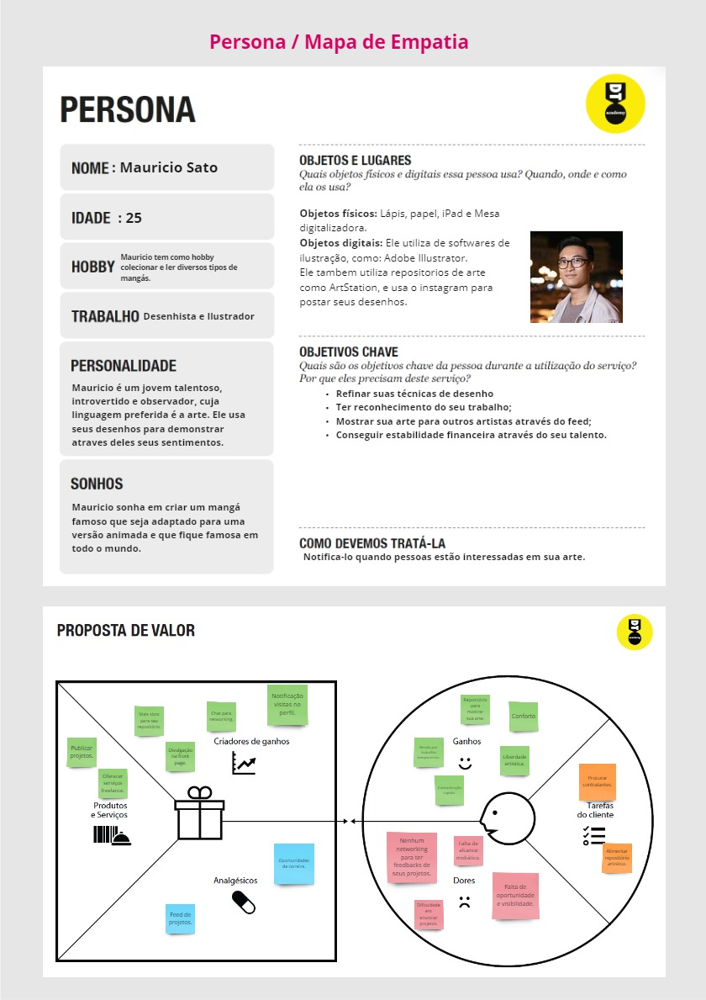
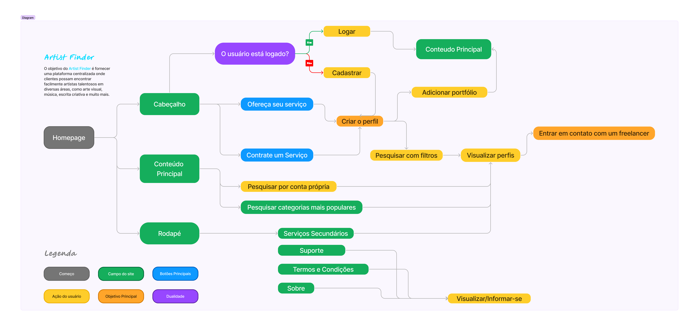
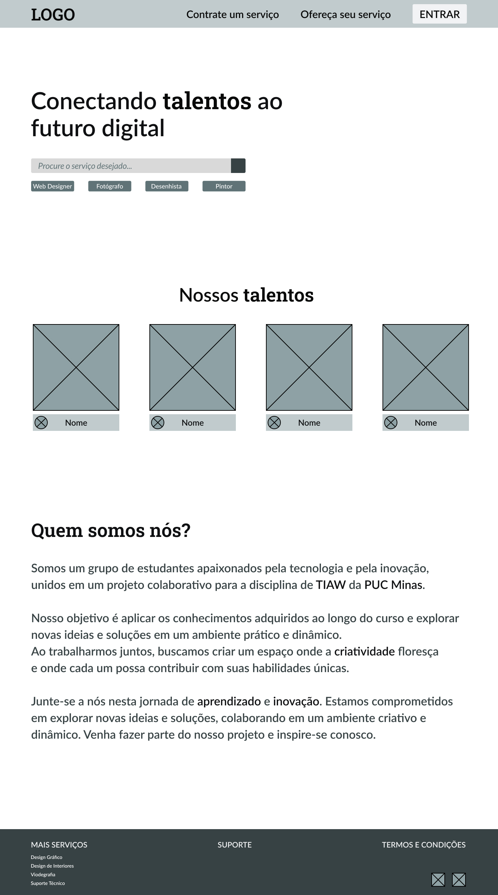
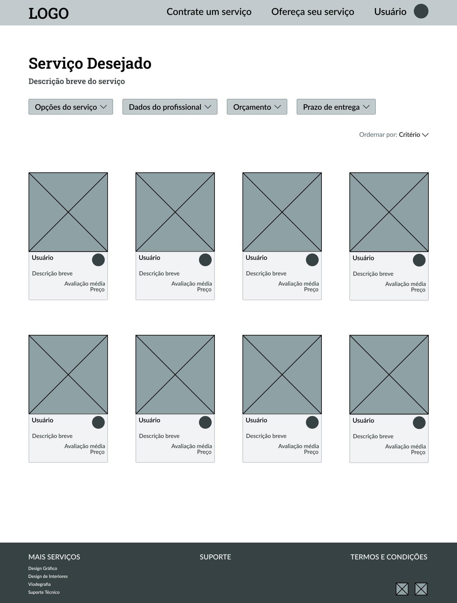
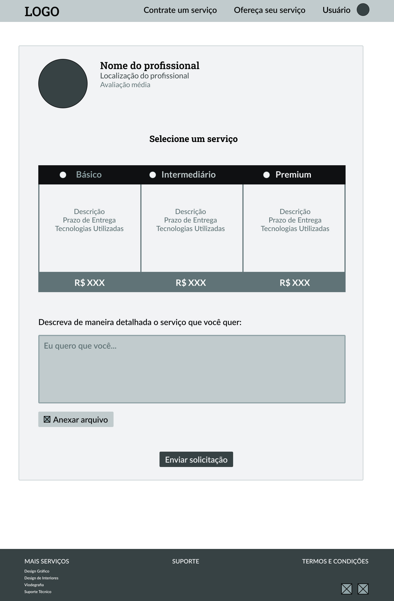
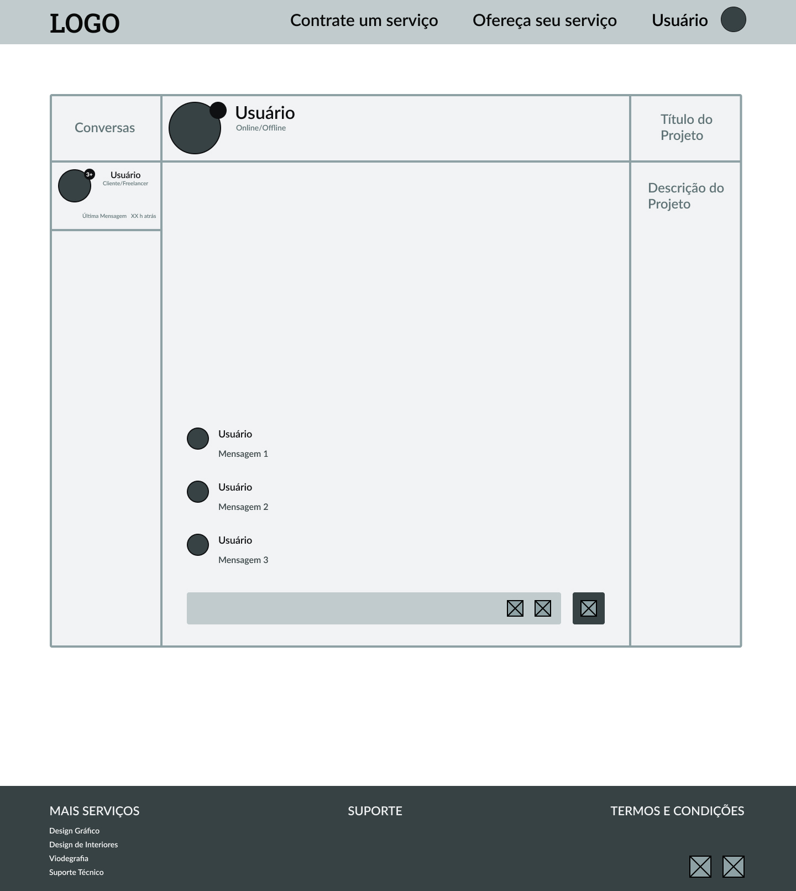

# Informações do Projeto

`Título do Projeto`

Artist Finder  

`Curso`

Análise e Desenvolvimento de Sistemas & Sistemas de Informação

`Disciplina`

Trabalho Interdisciplinar: Aplicações Web 

## Participantes

Os membros do grupo são:

- Diego Romero Ribeiro Chaves
- Filipe Augusto dos Santos Silva
- Pablo Marques Cordeiro
- Alfredo Rodrigues Simões Macedo Campos
- João Gabriel Soares Da Silva Franco
- Lucas Fernandes Nascimento

# Estrutura do Documento

- [Informações do Projeto](#informações-do-projeto)
  - [Participantes](#participantes)
- [Estrutura do Documento](#estrutura-do-documento)
- [Introdução](#introdução)
  - [Problema](#problema)
  - [Objetivos](#objetivos)
  - [Justificativa](#justificativa)
  - [Público-Alvo](#público-alvo)
- [Especificações do Projeto](#especificações-do-projeto)
  - [Personas e Mapas de Empatia](#personas-e-mapas-de-empatia)
  - [Histórias de Usuários](#histórias-de-usuários)
  - [Requisitos](#requisitos)
    - [Requisitos Funcionais](#requisitos-funcionais)
    - [Requisitos não Funcionais](#requisitos-não-funcionais)
  - [Restrições](#restrições)
- [Projeto de Interface](#projeto-de-interface)
  - [User Flow](#user-flow)
  - [Wireframes](#wireframes)
- [Metodologia](#metodologia)
  - [Divisão de Papéis](#divisão-de-papéis)
  - [Ferramentas](#ferramentas)
  - [Controle de Versão](#controle-de-versão)
- [**############## SPRINT 1 ACABA AQUI #############**](#-sprint-1-acaba-aqui-)
- [Projeto da Solução](#projeto-da-solução)
  - [Tecnologias Utilizadas](#tecnologias-utilizadas)
  - [Arquitetura da solução](#arquitetura-da-solução)
- [Avaliação da Aplicação](#avaliação-da-aplicação)
  - [Plano de Testes](#plano-de-testes)
  - [Ferramentas de Testes (Opcional)](#ferramentas-de-testes-opcional)
  - [Registros de Testes](#registros-de-testes)
- [Referências](#referências)

# Introdução

Bem-vindo ao Artist Finder, a plataforma online projetada para conectar artistas talentosos a clientes em busca de talento criativo. Com uma interface intuitiva e poderosas o Artist Finder facilita a descoberta e contratação de artistas para uma variedade de projetos. Explore nossa comunidade de artistas e descubra o talento certo para transformar suas ideias em realidade.

## Problema

Os artistas em geral hoje enfrentam uma luta constante para encontrar oportunidades que correspondam às suas habilidades e paixões, devido à escassez de conexões e à dificuldade em divulgar seus portfólios. Enquanto isso, os clientes em busca de talentos qualificados muitas vezes se veem perdidos em um mar de opções dispersas, sem uma plataforma centralizada e confiável para encontrar e avaliar profissionais artistas freelancer. Essa lacuna na conexão entre ambos os grupos cria desafios significativos, limitando as opções disponíveis para ambos os lados e dificultando o crescimento profissional e financeiro dos artistas e profissionais da criatividade. Ao mesmo tempo em que prejudica os clientes na busca por soluções adequadas para seus projetos.

## Objetivos

Nosso principal objetivo é aproximar os dois mundos; tanto os clientes quanto os artistas freelancers, fornecendo um espaço para adicionarem seus portfólios, e apresentarem sua arte. Queremos a partir deste objetivo, abrir espaços para colocarem seu estilo de arte único.

## Justificativa

Os artistas digitais hoje em dia, tem muita dificuldade para anunciar seus trabalhos, e isso faz parte de uma junção de dois fatores principais: 

- A demora para possíveis clientes encontrarem artistas para seus objetivos específicos. 
- A dificuldade dos artistas apresentarem seus trabalhos, através de um portfólio com ferramentas que atraiam um possível cliente.

## Público-Alvo

 Nosso público-alvo são jovens adultos entre 18 aos 40 anos que estão começando a se desenvolver profissionalmente, sejam artistas independentes e estejam procurando trabalhos freelancer para expandir sua rede de contatos profissional, mostrar seus talentos e assumir projetos remunerados. Por outro lado, empresas que procuram talentos criativos para projetos, projetos esses, administrados por adultos de meia-idade entre 40 e 65 anos que trabalham em áreas como marketing, publicidade, design de produtos, entre outros. 

# Especificações do Projeto

As especificações do projeto foram estruturadas com base em pesquisas detalhadas realizadas com usuários e profissionais da área artística. Essas pesquisas forneceram insights valiosos sobre as necessidades, preferências e expectativas dos usuários, direcionando o desenvolvimento de uma plataforma intuitiva, eficaz e centrada no usuário.

## Personas e Mapas de Empatia

Persona 1:

Persona 2:

Persona 3:

## Histórias de Usuários

Com base na análise das personas forma identificadas as seguintes histórias de usuários:

|EU COMO... `PERSONA`| QUERO/PRECISO ... `FUNCIONALIDADE` |PARA ... `MOTIVO/VALOR`                 |
|--------------------|------------------------------------|----------------------------------------|
|Larissa Alves  | Expor meu trabalho para ter mais alcance entre empresas | Aumentar minha renda mensal fazendo mais freelances de arte digital|
|Marcos Terra | Achar mais artistas que trabalham na minha área | Ganhar mais conhecimento sobre arte e aprimorar minhas técnicas |
|Fernando Pereira | Procurar artistas que atendem a minha necessidade | Conseguir um logotipo para minha nova empresa |
|Mateus Calixto | Conseguir configurar meu perfil e expor meu portfólio de maneira que me agrade | Trabalhar em uma área confortável para me motivar mais |
|Álvaro dos Santos | Desejo um site específico para artistas | Achar com mais facilidade um serviço de freelance requisitado pela empresa |
|Rogério Gomes | Forma de pagamento seguras | Ter segurança quando for efetuar uma compra no site |
|Bruna Silva | Um meio de comunicação com os donos do site | Ter apoio quando houver alguma dúvida ou algum erro |

## Requisitos

As tabelas que se seguem apresentam os requisitos funcionais e não funcionais que detalham o escopo do projeto.

### Requisitos Funcionais

|ID    | Descrição do Requisito  | Prioridade |
|------|-----------------------------------------|------|
|RF-001| Carossel                                | ALTA | 
|RF-002| Barra de Pesquisa                       | MÉDIA |
|RF-003| Editar Perfil                           | ALTA |
|RF-004| Gráfico de Vendas                       | BAIXA |
|RF-005| Filtros                                 | MÉDIA |
|RF-006| Calendário                              | BAIXA |
|RF-007| Avaliação por Estrelas                  | ALTA |
|RF-008| Chat Interativo                        | ALTA |
|RF-009| Portfólio                              | ALTA |

### Requisitos não Funcionais

|ID     | Descrição do Requisito  |Prioridade |
|-------|-------------------------|-----------------------------|
|RNF-001| Design responsivo                             | MÉDIA | 

## Restrições

O projeto está restrito pelos itens apresentados na tabela a seguir.

|ID| Restrição                                             |
|--|-------------------------------------------------------|
|01| O projeto deverá ser entregue até o final do semestre |
|02| Não pode ser desenvolvido um módulo de backend        |

# Projeto de Interface

Nossa plataforma foi concebida com um propósito claro em mente: facilitar a conexão entre profissionais freelancers e clientes em busca de profissionais qualificados. Reconhecendo as dificuldades enfrentadas tanto pelos profissionais em divulgar seus trabalhos quanto pelos clientes em encontrar esses talentos, desenvolvemos uma série de requisitos cuidadosamente planejados para atender a essas necessidades específicas.

Principais requisitos que compõe a aplicação:

- Chat Interativo:

Facilita a comunicação direta entre clientes e freelancers, permitindo a discussão de projetos e esclarecimento de dúvidas de forma rápida e eficiente.

- Carossel:

Destaca obras de destaque na página principal, proporcionando aos clientes uma visão rápida e inspiradora do talento disponível na plataforma.

- Portfólio Personalizado:

Permite que os freelancers exibam seus trabalhos anteriores de forma detalhada, ajudando os clientes a avaliar sua experiência e estilo.

- Avaliações Transparentes:

Oferece um sistema de avaliação transparente, através de comentários e estrelas, permitindo que os clientes forneçam feedback detalhado sobre a experiência com os freelancers.

A elaboração dos requisitos teve como ponto de partida as pesquisas com os profissionais freelancer, a partir daí, com as necessidades em mente, conseguimos pensar em funcionalidades que atendam esses profissionais, tornando assim, a plataforma fácil e útil. Os requisitos não funcionais tiveram como base heurísticas que já existem em sites nesse segmento, sendo assim, torna-se necessário a adição desses requisitos para correta adaptação no mercado.

## User Flow

O User Flow do site foi cuidadosamente planejado para atender a dois objetivos principais:

- Criação de Perfil:

Permitindo que os usuários criem um perfil, eles podem acessar ferramentas como a criação de um perfil freelancer, adição de portfólio e descrição. Ou, se preferirem, podem visualizar perfis de freelancers, filtrar pesquisas de acordo com suas necessidades específicas.

- Contato com um Freelancer: 

O objetivo final é facilitar o contato direto entre cliente e freelancer, permitindo que o cliente obtenha serviços de qualidade de um profissional qualificado. Este objetivo finaliza o fluxo do usuário, proporcionando uma solução direta e eficaz para as necessidades do cliente.

[Acesso ao User Flow no Figma](https://www.figma.com/file/0ixRcP56azFk2yjPxuDp22/user-flow?type=whiteboard&node-id=0%3A1&t=2jR80DNmsKhxJwG3-1)

## Wireframes

O Wireframe do site segue o padrão:
- Cabeçalho: contendo logo, barra de navegação com dois botões: Contratar um Serviço (para clientes) e Oferecer um Serviço (para profissionais)
- Conteúdo Principal: contendo todas as informações, funcionalidades relevantes à experiência do usuário, imagens e hyperlinks, é onde o conteúdo do site será propriamente colocado.
- Rodapé: contendo serviços secundários, suporte e termos e condições.

Homepage:

A homepage terá uma barra de pesquisa para o usuário poder pesquisar de acordo com suas preferências, bem como escolher pela sugestão de categorias mais buscadas. Além disso, terá um carrossel em destaque dos artistas premium, de modo que sua arte seja exibida na página principal do site.

Explorar:

A página de explorar irá permitir o usuário visualizar os perfis dos artistas que mais se encaixam com as preferências pesquisadas, além de permitir o cliente filtrar ainda mais a pesquisa, de modo que ache exatamente um artista freelancer que combine com seu fit.

Edição de perfil:

A página de editar perfil permitirá que o artista complete seu perfil com várias informações relevantes, bem como permitirá que ele adicione seu portfólio.

Contratar um freelancer:

A página de contato com o freelancer servirá quando o cliente visualizar um perfil específico e selecioná-lo de acordo com suas preferências, a partir daí, ele poderá selecionar dentre os planos que o artista oferece, do mais barato, intermediário, ao mais caro, e assim mandar uma mensagem para ele combinando o projeto a ser desenvolvido.

Chat:

O chat irá permitir um contato facilitado entre cliente e usuário, além da troca de mensagens, permitirá a anexação de arquivos.

[Acesso ao Protótipo Interativo](https://www.figma.com/proto/xhMqePLbQ48FSjh0R09G9H/Artist-Finder?type=design&node-id=49-27&scaling=min-zoom&page-id=49%3A25&starting-point-node-id=49%3A27)

# Metodologia

Para desenvolver o Artist Finder, adotamos uma abordagem colaborativa e iterativa, fundamentada nas metodologias ágeis, Design Thinking e Scrum.
Inicialmente, o grupo se reuniu para discutir ideias e estabelecer os objetivos do projeto. Utilizamos o Design Thinking como base, registrando 
nossas anotações e insights no Miro, o que nos permitiu visualizar e organizar nossas ideias de forma colaborativa. Após a definição dos objetivos, traçamos metas claras e dividimos as tarefas entre os membros da equipe, seguindo os princípios do Scrum.
Designamos papéis específicos, como entrevistar o público-alvo, fazer a documentação do projeto e prototipar a interface do site, garantindo uma distribuição equilibrada de responsabilidades.
Para facilitar a comunicação e colaboração, utilizamos ferramentas como WhatsApp e Discord para troca de mensagens e reuniões virtuais. O Figma foi empregado para o desenvolvimento da identidade visual e prototipagem da interface do usuário, permitindo uma iteração rápida e feedback contínuo. 
Além disso, a gestão de configuração do projeto foi realizada através do GitHub, onde mantivemos um repositório centralizado contendo o código-fonte, documentação e acompanhamento das atividades.

## Divisão de Papéis

Os papéis foram divididos entre os membros do grupo de acordo com a necessidade das tarefas que surgiam em paralelo com a disponibilidade de cada membro do grupo, as decisões foram feitas através de chat no WhatsApp e ligações no Discord.

- Filipe Augusto dos Santos Silva: Responsável por aplicar pesquisas, criação e edição dos slides, plano de entregas, organização de reuniões, formatação de ideias e participação no Design Thinking.

- Pablo Marques Cordeiro: Ideação, documentação de stakeholders, pesquisas qualitativas, highlights de pesquisa, personas no Design Thinking e documentação de proposta de valores.

- Lucas Fernandes Nascimento: Responsável pela criação do Wireframe, Userflow, pelo Design Thinking, formatação da documentação introdutória e organização do repositório.

- João Gabriel Soares Da Silva Franco: Responsável pela criação da documentação introdutória do relatório técnico e pelo Design Thinking.

- Diego Romero Ribeiro Chaves: Participação na documentação de contexto e especificações do projeto.

- Alfredo Rodrigues Simões Macedo Campos: Participação no Design Thinking, pesquisa qualitativa e ideação.

Para além disso, utilizamos a ferramenta Trello para gerenciar funções, definir prazos e assim, facilitar a organização do grupo. 

No Trello, os cartões representavam o prazo das tarefas, concluídas, em andamento ou a fazer, a medida que uma atividade avançava na conclusão, ela era movida para outro cartão. Além disso. A cor verde representava uma tarefa concluída, azul quase concluída, amarelo em aberto e vermelho aquela que não foi iniciada. 

## Ferramentas

Os artefatos do projeto são desenvolvidos a partir de diversas plataformas e a relação dos ambientes com seu respectivo propósito é apresentada na tabela que se segue.

| Ambiente  | Plataforma              |Link de Acesso |
|-----------|-------------------------|---------------|
|Processo de Design Thinkgin  | Miro |  https://miro.com/app/board/uXjVNjOu4fI=/?share_link_id=591125358422 | 
|Gestão de Tarefas  | Trello |  https://trello.com/invite/b/qeJBkJK6/ATTIc2f4fb056758e231e943f2bac66f2e8fD5E28FAE/tiaw-sprint-1 | 
|Repositório de código | GitHub | https://github.com/ICEI-PUC-Minas-PCO-SI/pco-si-2024-1-tiaw-artist-finder | 
|Hospedagem do site | Heroku |  https://XXXXXXX.herokuapp.com | 
|Protótipo Interativo | MavelApp ou Figma | https://www.figma.com/proto/xhMqePLbQ48FSjh0R09G9H/Artist-Finder?type=design&node-id=49-27&scaling=min-zoom&page-id=49%3A25&starting-point-node-id=49%3A27 | 

## Controle de Versão

Na primeira sprint, houve apenas commits para criação de documentação, logo não houve tanta aplicabilidade das tags combinadas, porém, na segunda e terceira sprint as seguintes tags foram aplicadas:

O projeto segue a seguinte convenção para o nome de branchs: 

- `master`: versão estável já testada do software
- `dev`: versão de desenvolvimento do software

Quanto à gerência de issues, o projeto adota a seguinte convenção para
etiquetas:

- `bugfix`: uma funcionalidade encontra-se com problemas
- `feature`: uma nova funcionalidade precisa ser introduzida
- `merge`: preparação e adequação do código para sofrer merge de features

# **############## SPRINT 1 ACABA AQUI #############**

## Projeto de Solução

O projeto Artist Finder foi concebido para criar uma plataforma digital que conecta artistas freelancers a potenciais clientes, facilitando a contratação de serviços artísticos. A solução proposta se baseia em uma série de funcionalidades que atendem tanto às necessidades dos artistas quanto dos clientes, garantindo uma experiência de usuário intuitiva, eficiente e segura. Abaixo, detalhamos os principais componentes do projeto de solução:

### Objetivos do Projeto

1. **Conectar Artistas e Clientes**
   - Facilitar o encontro entre artistas freelancers e clientes em busca de serviços artísticos, como ilustrações, design gráfico, pintura, entre outros.

2. **Oferecer uma Experiência de Usuário Intuitiva**
   - Garantir que a navegação na plataforma seja fácil e agradável, com ferramentas de busca e filtros eficientes.

3. **Proporcionar Ferramentas para Gerenciamento de Portfólios**
   - Permitir que artistas exibam seus trabalhos de forma organizada e atraente.

4. **Implementar um Sistema de Avaliação e Feedback**
   - Ajudar clientes a tomar decisões informadas com base nas avaliações e feedbacks de outros usuários.

## Tecnologias Utilizadas

O projeto Artist Finder foi desenvolvido utilizando uma variedade de tecnologias front-end e um fake back-end para garantir uma solução robusta e eficiente. Abaixo, detalhamos cada tecnologia utilizada e sua aplicação no projeto:

### Front-End

1. **HTML (HyperText Markup Language)**
   - **Descrição**: Utilizado para estruturar o conteúdo do site.
   - **Aplicação**: Todas as páginas do site foram criadas usando HTML para definir a estrutura básica dos elementos.

2. **CSS (Cascading Style Sheets)**
   - **Descrição**: Utilizado para estilizar e melhorar a aparência visual do site.
   - **Aplicação**: CSS foi utilizado para aplicar estilos personalizados às páginas, garantindo um design atraente e consistente.

3. **JavaScript**
   - **Descrição**: Linguagem de programação usada para adicionar interatividade e lógica ao site.
   - **Aplicação**: JavaScript foi implementado para funcionalidades dinâmicas como validação de formulários, manipulação do DOM, e comunicação assíncrona com o servidor.

4. **Bootstrap**
   - **Descrição**: Framework front-end para desenvolver interfaces responsivas.
   - **Aplicação**: Bootstrap foi utilizado para criar modais, navegação, e garantir a responsividade do design em diferentes dispositivos.

5. **Chart.js**
   - **Descrição**: Biblioteca JavaScript para criar gráficos interativos.
   - **Aplicação**: Chart.js foi utilizada para implementar gráficos de vendas e estatísticas de uso na plataforma.

6. **Swiper**
   - **Descrição**: Biblioteca para criação de sliders/carrosséis.
   - **Aplicação**: Swiper foi utilizada para desenvolver carrosséis na página principal, destacando artistas e suas obras.

7. **jQuery**
   - **Descrição**: Biblioteca JavaScript que simplifica a manipulação de HTML e eventos.
   - **Aplicação**: jQuery foi utilizado para facilitar manipulações do DOM, eventos e AJAX.

8. **Font Awesome**
   - **Descrição**: Biblioteca de ícones vetoriais e fontes.
   - **Aplicação**: Font Awesome foi utilizada para adicionar ícones ao site, melhorando a interface do usuário.

### Armazenamento de dados

1. **Fake Back-End com JSON-Server via Node.js**
   - **Descrição**: Ferramenta para criar um servidor RESTful simulado usando JSON.
   - **Aplicação**: JSON-Server foi utilizado para simular a persistência de dados, permitindo operações CRUD (Create, Read, Update, Delete) sem necessidade de um banco de dados real.

2. **Local Storage**
   - **Descrição**: Mecanismo de armazenamento local do navegador.
   - **Aplicação**: Local Storage foi utilizado para armazenar temporariamente dados do usuário no navegador, complementando a persistência de dados fornecida pelo JSON-Server.

### Ferramentas de Desenvolvimento

1. **Visual Studio Code (VS Code)**
   - **Descrição**: IDE usada para desenvolvimento de código.
   - **Aplicação**: VS Code foi a IDE principal utilizada para escrever, editar e depurar o código do projeto.

### Relacionamento com o Escopo do Projeto

#### Funcionalidades Desenvolvidas

1. **Carrossel**
   - **Tecnologias**: HTML, CSS, JavaScript, Swiper
   - **Descrição**: Destaca obras de destaque na página principal, proporcionando uma visão rápida e inspiradora do talento disponível na plataforma.

2. **Barra de Pesquisa e Filtros**
   - **Tecnologias**: HTML, CSS, JavaScript
   - **Descrição**: Implementação de uma barra de pesquisa com filtros avançados para facilitar a busca por artistas e suas obras.

3. **Edição de Perfil**
   - **Tecnologias**: HTML, CSS, JavaScript
   - **Descrição**: Permite que artistas completem seus perfis com informações relevantes e adicionem seus portfólios.

4. **Gráfico de Vendas**
   - **Tecnologias**: HTML, CSS, JavaScript, Chart.js
   - **Descrição**: Exibição de gráficos de vendas para que artistas possam acompanhar seu desempenho.

5. **Avaliação por Estrelas**
   - **Tecnologias**: HTML, CSS, JavaScript, Bootstrap
   - **Descrição**: Sistema de avaliação por estrelas para que clientes possam fornecer feedback sobre artistas.

6. **Chat Interativo**
   - **Tecnologias**: HTML, CSS, JavaScript
   - **Descrição**: Facilita a comunicação direta entre clientes e artistas, permitindo discussões de projetos e esclarecimento de dúvidas.

7. **Portfólio**
   - **Tecnologias**: HTML, CSS, JavaScript
   - **Descrição**: Permite que artistas exibam seus trabalhos anteriores de forma detalhada, ajudando clientes a avaliar sua experiência e estilo.

8. **Persistência de Dados**
   - **Tecnologias**: JSON-Server via Node.js, Local Storage
   - **Descrição**: Armazenamento e gerenciamento de dados dos usuários, portfólios, avaliações e mensagens.

### Descrição do User Flow

Este user flow ilustra a experiência do usuário em uma plataforma dinâmica para artistas e clientes. Começando pela **Home Page**, os visitantes são introduzidos a um mundo de arte e criatividade, incentivando-os a **Criar uma Conta** para explorar e participar ativamente.

#### Visualização da Home Page
Através da visualização da Home Page, os visitantes do site, sejam eles clientes ou artistas, terão uma introdução atrativa ao conteúdo disponível. Os clientes poderão visualizar diversos trabalhos postados no site, o que pode cativá-los e incentivá-los a criar uma conta para buscar um artista específico para seus projetos. Por outro lado, os artistas poderão explorar os trabalhos de seus colegas de profissão, o que pode inspirá-los e motivá-los a criar uma conta em busca de oportunidades e para apresentar suas próprias criações. A Home Page, portanto, atua como um ponto de entrada envolvente para ambos os públicos, destacando a qualidade e a diversidade dos serviços artísticos oferecidos na plataforma.

#### Explorar
Permite a visualização, filtro e pesquisa dos perfis de artistas cadastrados no site, fazendo com que clientes possam procurar profissionais que combinem com seu fit e artistas possam se inspirar.

#### Criar uma conta
A partir da visualização da Home Page ou do Explorar, o usuário vai se sentir motivado a criar uma conta devido à exposição inicial aos trabalhos artísticos destacados.

#### Visualizar Perfil
Após o usuário visualizar o explorar, ele poderá clicar em um perfil que interessa para ver maiores detalhes, como portfólio e descrição.

#### Calendário
Permite que o usuário faça um controle simplificado da sua agenda, adicionando eventos conforme as demandas aparecem.

#### Chat
Permite a comunicação simplificada entre usuários do site por meio de mensagens de texto.

#### Editar Perfil
Permite que o usuário edite os parâmetros do seu perfil da maneira que preferir, além de adicionar um portfólio com seus trabalhos mais relevantes.

## Arquitetura da solução

> 

## 1. Navegador

### 1.1 Tecnologias Utilizadas
- HTML
- CSS
- JavaScript
- Framework Bootstrap
- Bibliotecas JS:
  - Swiper
  - Chart.js

### 1.2 Funcionalidades
- **Interface do Usuário**: 
  - Construída usando HTML, CSS e Bootstrap para um design responsivo.
  - Swiper para sliders/carrosséis.
  - Chart.js para gráficos e visualizações de dados.
  
- **Armazenamento Local**:
  - **Local Storage** para armazenar:
    - Fotos de perfil
    - Portfólio
    - Capa
    - Mensagens via chat
    - Calendário

### 1.3 Fluxo de Dados
- Os dados armazenados no Local Storage são utilizados para exibir informações no site.
- Interações do usuário (mensagens, atualizações de perfil, etc.) são armazenadas diretamente no Local Storage.

## 2. Nuvem

### 2.1 Tecnologias Utilizadas
- **Hospedagem**: Vercel
- **Banco de Dados**: API fake com json-server

### 2.2 Funcionalidades
- **API REST**:
  - Servida pelo json-server, hospedado na Vercel.
  - Manipulação de dados do usuário, dados de venda e dados de avaliação.
  
- **Sincronização**:
  - O navegador se conecta com a API para buscar e atualizar dados conforme necessário.
  - Sincronização periódica entre Local Storage e a API para garantir que os dados locais e remotos estejam atualizados.

### 2.3 Fluxo de Dados
- **Leitura de Dados**:
  - O navegador faz chamadas GET para a API no json-server para obter dados do usuário, vendas e avaliações.
  
- **Escrita de Dados**:
  - O navegador faz chamadas POST/PUT/DELETE para a API para atualizar ou remover dados conforme necessário.
  - Após operações de escrita, o Local Storage é atualizado para refletir as mudanças.

## 3. Integração

### 3.1 Comunicação Navegador-Nuvem
- **Fetch API**:
  - Utilizada no navegador para fazer requisições assíncronas (GET, POST, PUT, DELETE) para a API no json-server.
  
### 3.2 Sincronização de Dados
- **Inicialização**:
  - Ao carregar a página, os dados são primeiramente carregados do Local Storage.
  - Caso não existam dados no Local Storage, uma requisição é feita à API para obter os dados iniciais.
  
- **Atualizações em Tempo Real**:
  - Interações do usuário que modificam dados locais (como enviar uma mensagem ou atualizar o perfil) disparam requisições para atualizar os dados na API.
  - Sincronização periódica para garantir que as alterações locais e remotas estejam em sincronia.

### 3.3 Estrutura de Requisições
- **GET /usuarios**: Obtém dados dos usuários.
- **POST /usuarios**: Cria um novo usuário.
- **PUT /usuarios/id**: Atualiza os dados de um usuário existente.
- **GET /vendas/idUsuarioCriador**: Obtém dados de uma venda de acordo com o usuário logado.
- **POST /vendas/**: Cria uma nova venda.
- **PUT /vendas/id**: Atualiza uma venda existente.
- **DELETE /vendas/id**: Remove uma venda.
- **GET /avaliacoes/idAvaliado**: Obtém dados de avaliações.
- **POST /avaliacoes**: Cria uma nova avaliação.

# Avaliação da Aplicação

A avaliação da aplicação Artist Finder foi conduzida com o objetivo de garantir que todas as funcionalidades principais funcionem conforme os requisitos e ofereçam uma experiência de usuário satisfatória. Abaixo, apresentamos os cenários de testes utilizados para validar a aplicação.

### Cenários de Testes

Os cenários de testes foram escolhidos para demonstrar que os requisitos do projeto estão sendo atendidos. Cada cenário foi projetado para avaliar funcionalidades específicas, desde a criação de contas até a navegação no site e a interação entre usuários.

1. **Criação de Conta**
   - Verificação se usuários podem criar contas com sucesso, preenchendo os campos obrigatórios.
   - Teste de validação de campos.

2. **Login e Logout**
   - Testar se usuários podem fazer login e logout corretamente.
   - Verificação de persistência da sessão entre navegações.

3. **Navegação na Home Page**
   - Visualicação correta de usuários que existem no site, com suas obras e redirecionamento funcional.
   - Testar a funcionalidade de carrosséis.

4. **Exploração de Perfis**
   - Teste de filtros e busca de artistas.
   - Verificação da exibição correta dos perfis de artistas.

5. **Visualização de Perfil**
   - Avaliação da funcionalidade de visualização de detalhes do perfil.
   - Teste da exibição de portfólios.

6. **Edição de Perfil**
   - Verificação se artistas podem editar seus perfis e adicionar trabalhos ao portfólio.
   - Teste da atualização dos dados no Local Storage e na API.

7. **Interação via Chat**
   - Testar se a comunicação entre clientes e artistas é funcional através do chat.
   - Verificação da persistência de mensagens no Local Storage.

8. **Sistema de Avaliação**
   - Avaliação da funcionalidade de avaliação por estrelas.
   - Teste de submissão e exibição de feedbacks.

9. **Calendário**
   - Teste da funcionalidade de adição e visualização de eventos no calendário.
   - Verificação da persistência de dados no Local Storage.

## Plano de Testes

#### Cenários Selecionados

Os cenários foram selecionados para cobrir as funcionalidades essenciais da plataforma Artist Finder. Detalhamos abaixo os cenários e as ferramentas utilizadas para cada teste.

1. **Criação de Conta**
   - **Funcionalidade Avaliada**: Registro de novos usuários.
   - **Grupo de Usuários**: Novos visitantes do site.
   - **Ferramentas Utilizadas**: Testes manuais, Ferramentas de inspeção do navegador.

2. **Login e Logout**
   - **Funcionalidade Avaliada**: Autenticação de usuários.
   - **Grupo de Usuários**: Usuários registrados.
   - **Ferramentas Utilizadas**: Testes manuais, Ferramentas de inspeção do navegador.

3. **Navegação na Home Page**
   - **Funcionalidade Avaliada**: Exibição de conteúdos e carrosséis.
   - **Grupo de Usuários**: Todos os visitantes.
   - **Ferramentas Utilizadas**: Testes manuais, Ferramentas de inspeção do navegador.

4. **Exploração de Perfis**
   - **Funcionalidade Avaliada**: Busca e filtros de perfis.
   - **Grupo de Usuários**: Clientes em busca de artistas.
   - **Ferramentas Utilizadas**: Testes manuais, Ferramentas de inspeção do navegador.

5. **Visualização de Perfil**
   - **Funcionalidade Avaliada**: Detalhamento de perfis de artistas.
   - **Grupo de Usuários**: Clientes e outros artistas.
   - **Ferramentas Utilizadas**: Testes manuais, Ferramentas de inspeção do navegador.

6. **Edição de Perfil**
   - **Funcionalidade Avaliada**: Atualização de perfis e portfólios.
   - **Grupo de Usuários**: Artistas registrados.
   - **Ferramentas Utilizadas**: Testes manuais, Ferramentas de inspeção do navegador.

7. **Interação via Chat**
   - **Funcionalidade Avaliada**: Sistema de mensagens entre usuários.
   - **Grupo de Usuários**: Clientes e artistas.
   - **Ferramentas Utilizadas**: Testes manuais, Ferramentas de inspeção do navegador.

8. **Sistema de Avaliação**
   - **Funcionalidade Avaliada**: Submissão e exibição de avaliações.
   - **Grupo de Usuários**: Clientes que contrataram artistas.
   - **Ferramentas Utilizadas**: Testes manuais, Ferramentas de inspeção do navegador.

9. **Calendário**
   - **Funcionalidade Avaliada**: Adição e visualização de eventos.
   - **Grupo de Usuários**: Artistas e clientes.
   - **Ferramentas Utilizadas**: Testes manuais, Ferramentas de inspeção do navegador.

## Ferramentas de Testes (Opcional)

Para realizar os testes, utilizamos diversas ferramentas que facilitaram a validação das funcionalidades e a identificação de possíveis problemas.

1. **Testes Manuais**
   - **Descrição**: Realizados por membros da equipe para simular o comportamento do usuário.
   - **Aplicação**: Utilizados para verificar a navegação e a usabilidade geral da aplicação.

2. **Ferramentas de Inspeção do Navegador**
   - **Descrição**: Ferramentas como DevTools do Chrome para inspecionar e debugar o código.
   - **Aplicação**: Utilizadas para verificar o comportamento do DOM, monitorar requests, e inspecionar o Local Storage.

## Registros de Testes

......  COLOQUE AQUI O SEU TEXTO ......

> Discorra sobre os resultados do teste. Ressaltando pontos fortes e
> fracos identificados na solução. Comente como o grupo pretende atacar
> esses pontos nas próximas iterações. Apresente as falhas detectadas e
> as melhorias geradas a partir dos resultados obtidos nos testes.

# Referências

- Geração de imagens de capa: https://picsum.photos/
- Imagens de usuários mockados: https://thispersondoesnotexist.com/
- Geração de fotos aleatórias de perfil: https://robohash.org/
- Inspiração de sidebar do gráfico de vendas:https://www.youtube.com/watch?v=lZVQGjTEX-w
- Inspiração de calendário: https://youtu.be/6EVgmpm4z5U?si=B4T8cb0YXLm7Dltr
- Inspiração de rodapé: https://www.youtube.com/watch?v=SUFzgCwJZkk